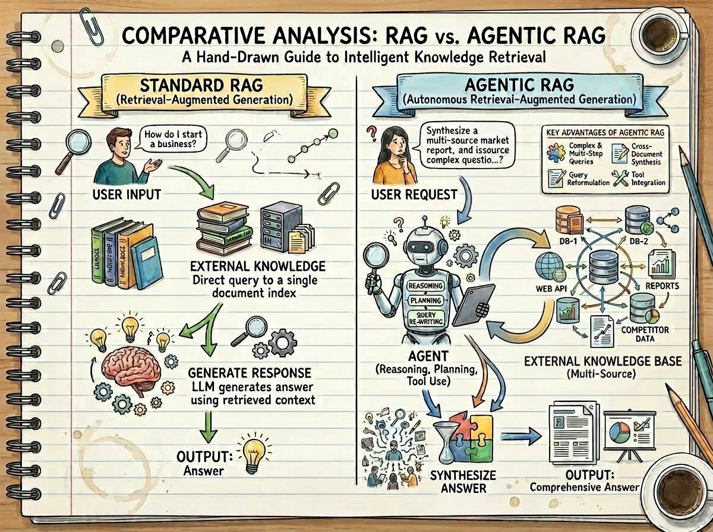
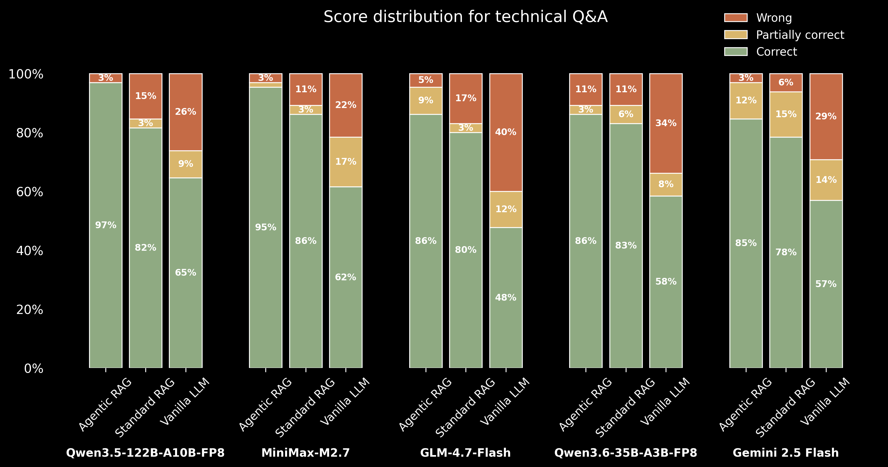

# **Agentic Retrieval-Augmented-Generation (RAG): AI Agent for self-query and query reformulation**

## **Project Description**

This project implements and evaluates **Agentic Retrieval-Augmented Generation (RAG)**, comparing its performance against traditional RAG and standalone Large Language Models (LLMs) when answering technical questions about the Hugging Face ecosystem.

While traditional RAG systems are powerful, they follow a fixed retrieve-then-generate pattern. This project goes further by introducing an **agent-based approach** that enables dynamic decision-making, iterative query refinement, and adaptive tool use — addressing core limitations of basic RAG when dealing with complex or multi-step queries. The agent intelligently interacts with external knowledge sources, evaluates retrieved content, and refines its strategy based on outcomes, resulting in more accurate, robust, and contextually rich answers. This repository leverages the [smolagents](https://github.com/huggingface/smolagents) package to build the underlying agentic framework.



### **Key Capabilities**

| Capability | Description |
|---|---|
| **Query Strategy & Refinement** | Strategically determines and combines keywords for search queries, iteratively refining them based on retrieval results to optimize relevance and coverage. |
| **Iterative Query Refinement** | If initial retrieval is insufficient, the agent reformulates queries or expands the number of retrieved documents. |
| **Document Evaluation** | Assesses the relevance and quality of retrieved information relative to the question before generating an answer. |
| **Multi-step Reasoning** | Chains together multiple retrieval and generation steps to answer complex questions. |
| **Self-Correction & Backtracking** | If a generated answer is unsatisfactory, the agent devises and executes alternative retrieval strategies. |

## **Installation**

### **Prerequisites**

- Python **3.12+**
- A [Gemini API key](https://aistudio.google.com/app/apikey) (free tier available) or [Blablador API key](https://helmholtz-blablador.fz-juelich.de/)
- Git

### **Steps**

1. **Clone the repository**
   ```bash
   git clone https://github.com/Wen-ChuangChou/Agentic_RAG.git
   cd Agentic_RAG
   ```

2. **Create and activate a virtual environment** *(recommended)*
   ```bash
   python -m venv venv
   # Windows
   venv\Scripts\activate
   # macOS / Linux
   source venv/bin/activate
   ```

3. **Install dependencies**
   ```bash
   pip install -r requirement.txt
   ```

4. **Configure your API key**

   Create a `.env` file in the project root and add:
   ```env
   GEMINI_API_KEY=your_api_key_here
   Blablador_API_KEY=your_api_key_here
   ```

---

## **Usage**

There are three main scripts to run the evaluation pipeline and visualize the results.

---

### 1. Run the Evaluation — `agentic_rag.py`

This is the core script. It evaluates and compares three QA systems (Agentic RAG, Standard RAG, and Vanilla LLM) on the [Hugging Face technical Q&A dataset](https://huggingface.co/datasets/m-ric/huggingface_doc_qa_eval), using an LLM-as-judge for scoring. Results are saved as JSON files in the `results/` directory, and checkpoints are written to `checkpoints/` so long runs can be safely resumed.

```bash
python agentic_rag.py
```

**What it does:**
- Builds (or loads from cache) a FAISS vector database from the Hugging Face documentation corpus
- Runs Agentic RAG, Standard RAG, and Vanilla LLM inference on the evaluation dataset
- Scores each answer with an LLM judge and saves results to `results/<model_name>_vect<chunk_size>_t<temperature>.json`

> The model name and chunk size are configurable inside `main()` via the `config` dictionary and the `model_name` variable.

**Vector database pipeline** (`utils/vectordb_utils.py`):

| Feature | Detail |
|---|---|
| **Parallel splitting** | Documents split concurrently via `ThreadPoolExecutor` for large-scale speed-up |
| **Batch embedding** | Embeds in configurable batches (default 100), merging FAISS shards incrementally to manage memory |
| **Thread-safe processing** | `DocumentProcessor` uses threading locks to prevent race conditions |
| **Intelligent fallback** | Automatically falls back to sequential processing if parallel execution fails |
| **Deduplication** | Removes duplicate documents by content hash before indexing |
| **Persistent caching** | Saves/loads the FAISS index from `vectordb/` to skip expensive recomputation on repeat runs |

> [!TIP]
> **Use a GPU to create the vector store.** Embedding generation is heavily compute-bound: on this dataset a GPU completes the full build in **~14 seconds** (H100), while a CPU takes **more than 23 minutes** (AMD 5600x). If a GPU is available, ensure your `torch` installation is CUDA-enabled — the pipeline will use it automatically.

---

### 2. Visualize Performance Scores — `visualize_rag_performance.py`

Generates a grouped bar chart comparing the mean accuracy (%) of Agentic RAG, Standard RAG, and Vanilla LLM across all JSON result files found in the results directory. The plot is saved as `evaluation_scores.png`.

```bash
python visualize_rag_performance.py
# or specify a custom results directory:
python visualize_rag_performance.py --results_dir path/to/results
```

**Output:** `results/evaluation_scores.png`

---

### 3. Visualize Score Distribution — `visualize_correct_portion.py`

Generates a stacked bar chart showing the proportion of **Correct**, **Partially correct**, and **Wrong** answers for each system type and model. This gives a richer view of answer quality beyond simple accuracy. The plot is saved as `score_distribution.png`.

```bash
python visualize_correct_portion.py
# or specify a custom results directory:
python visualize_correct_portion.py --results_dir path/to/results
```

**Output:** `results/score_distribution.png`

---

## **Project Structure**

```
RAG_paper/
│
├── agentic_rag.py                  # Main evaluation script (Agentic RAG, Standard RAG, Vanilla LLM)
├── visualize_rag_performance.py    # Grouped bar chart of mean accuracy scores
├── visualize_correct_portion.py    # Stacked bar chart of score distribution
├── requirement.txt                 # Python dependencies
├── .env                            # API keys (not tracked by git)
│
├── utils/                          # Helper modules
│   ├── agent_tools.py              # RetrieverTool for the smolagents CodeAgent
│   ├── blablador_helper.py         # Blablador LLM API wrapper
│   ├── checkpoint_runner.py        # Checkpointing logic for long evaluations
│   ├── results_manager.py          # Save / load evaluation results to JSON
│   └── vectordb_utils.py           # FAISS vector database creation & caching (gte-small embeddings, cosine distance, parallel splitting, persistent cache)
│
├── prompts/                        # YAML prompt templates
│   ├── gemini_agent_system_prompt.yaml
│   ├── guide_agent_system_prompt.yaml
│   └── evaluation_prompt.yaml
│
├── results/                        # Evaluation outputs (JSON + plots)
│   ├── *.json                      # Per-model evaluation results
│   ├── evaluation_scores.png       # Grouped bar chart
│   └── score_distribution.png      # Stacked bar chart
│
├── checkpoints/                    # Intermediate checkpoints for resumable runs
├── vectordb/                       # Cached FAISS vector database
└── doc/                            # Additional documentation assets
```


## **Results**

Performance was evaluated using the [Hugging Face technical Q&A dataset](https://huggingface.co/datasets/m-ric/huggingface_doc_qa_eval). The results demonstrate that the Agentic RAG approach consistently outperforms standard RAG and standalone LLMs.

### **Performance Comparison**


The chart above shows that **Agentic RAG performance is consistently better than standard RAG and Vanilla LLM** across all evaluated LLMs.

### **Score Distribution and Model Strength**



The score distribution highlights that stronger models, such as **Qwen 3.5**, not only answer more questions correctly but also retrieve more accurate answers, resulting in fewer "partially correct" responses compared to other models.

## **Future Improvements**

To further enhance the performance, efficiency, and security of this Agentic RAG system, the following areas are identified for future development:

1. **Comprehensive Agent Telemetry** : System prompts are a critical factor in agentic performance. Implementing a robust telemetry system would allow for granular monitoring of agent behavior, enabling systematic comparison of different system prompts and reasoning patterns to identify the most effective configurations.

2. **Self-Refining Agent Prompting via Reinforcement Learning** : Leveraging Reinforcement Learning (RL) to allow an agent to iteratively refine its own system prompts. The goal is to optimize for factual accuracy while ensuring the agent maintains its existing capabilities. This approach can lead to more efficient retrieval strategies, reducing the number of necessary steps and improving alignment with complex task requirements.

3. **Private LLM Serving with vLLM** : Transitioning from external APIs (like Gemini or Blablador) to local or private HPC-hosted models using **vLLM**. This would significantly improve inference speeds and, more importantly, ensure data privacy by keeping sensitive database information within a secure, private GPU computing cluster—a crucial requirement for production-grade applications.

## **Reference:**

1. [Hugging Face Agentic RAG Cookbook](https://huggingface.co/learn/cookbook/agent_rag).
2. [Blablador](https://helmholtz-blablador.fz-juelich.de/).